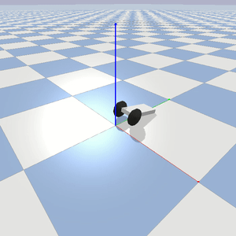

# Custom Gym Environments
Some custom Gym environments for reinforcement learning.

## Installation and environment registration

```bash
git clone https://github.com/PierreExeter/custom_gym_envs.git
conda env create -f environment.yml
conda activate gym_envs
pip install -e .   # to register the Gym environmnents locally
```

## Test the environments

Execute scripts in the test_envs folder. For example:

```
python test_envs/4_test_reacher2D.py
```

## Environments description

| Name     | Action space       | Observation space      | Rewards       |
| ---------| -------------------| -----------------------| ------------- |
| balancebot-v0 | Discrete(9): used to define wheel target velocity | Box(3,): [cube orientation , cube angular velocity , wheel velocity] | 0.1 - abs(self.vt - self.vd) * 0.005 |
| particle-v0 | Box(2,): [force_x, force_y] | Dict("achieved_goal": [coord_x, coord_y], "desired_goal": [coord_x, coord_y], "observation": [pos_x, pos_y, vel_x, vel_y])   | - dist (dense) or bool(dist <= distance_threshold) (sparse) |
| Reacher2Dof-v0 | Box(2,): [0.05 * torque_1, 0.05 * torque_2] | Box(8,): [target_x, target_y, dist_to_target_x, dist_to_target_y, joint0_angle, joint0_vel, joint1_angle, joint1_vel | [change in dist to target, electricity_cost, stuck_joint_cost] |
| Reacher2Dof-v1 | Box(2,): [0.05 * torque_1, 0.05 * torque_2] | Dict("achieved_goal": [tip_x, tip_y], "desired_goal": [target_x, target_y], "observation": *same as above* ) | - dist |
| widowx_reacher-v5 | Box(6,): [angle_change_joint1, angle_change_joint2, angle_change_joint3, angle_change_joint4, angle_change_joint5, angle_change_joint6] | Box(9,): [target_x, target_y, target_z, joint_angle1, joint_angle2, joint_angle3, joint_angle4, joint_angle5, joint_angle6] | - dist ^ 2 |
| widowx_reacher-v7 | Box(6,): [angle_change_joint1, angle_change_joint2, angle_change_joint3, angle_change_joint4, angle_change_joint5, angle_change_joint6] | Dict("achieved_goal": [tip_x, tip_y, tip_z], "desired_goal": [target_x, target_y, target_z], "observation": *same as above* ) | - dist ^ 2 |
| ReachingJaco-v1 | Box(7,): [joint1_angle + 0.05 * action1, joint2_angle + 0.05 * action2, joint3_angle + 0.05 * action3, joint4_angle + 0.05 * action4, joint5_angle + 0.05 * action5, joint6_angle + 0.05 * action6, joint7_angle + 0.05 * action7]  | Box(17,): [gripper_x - torso_x, gripper_y - torso_y, gripper_z - torso_z, gripper_x - target_x, gripper_y - target_y, gripper_z - target_z, joint_angle1, joint_angle2, joint_angle3, joint_angle4, joint_angle5, joint_angle6, joint_angle7, gripper_orient_x, gripper_orient_y, gripper_orient_z, gripper_orient_w]  | - dist |


### Balance Bot

A simple Pybullet robot. The goal is to maintain the cube upwards as long as possible. Adapted from [this repo](https://github.com/yconst/balance-bot/).

Environment name: 
- balancebot-v0
- balancebot-noise-v0




### Particle

A Goal Env (for testing Hindsight Experience Replay) where a red particle must reach the green target in a 2D plane. The particle is controlled by force. Adapted from [here](https://github.com/openai/baselines/issues/428)

Environment name: particle-v0


### Reacher2D

An articulated arm in a 2D plane composed of 1 to 6 joints. The goal is to bring the tip as close as possible to the target sphere. Adapted from [this repo](https://github.com/benelot/pybullet-gym).

Environment name: 
- Reacher1Dof-v0
- Reacher2Dof-v0
- Reacher3Dof-v0
- Reacher4Dof-v0
- Reacher5Dof-v0
- Reacher6Dof-v0
- Reacher1Dof-v1  # goalEnv
- Reacher2Dof-v1  # goalEnv
- Reacher3Dof-v1  # goalEnv
- Reacher4Dof-v1  # goalEnv
- Reacher5Dof-v1  # goalEnv
- Reacher6Dof-v1  # goalEnv


### WidowX arm

The WidowX robotic arm in Pybullet. The goal is to bring the tip as close as possible to the target sphere. Adapted from [this repo](https://github.com/bhyang/replab).

Environment name:
- widowx_reacher-v0   # environment for both the physical arm and the Pybullet simulation
- widowx_reacher-v1   # environment for the physical arm only 
- widowx_reacher-v2   # environment for the physical arm only + no start_rospy method 
- widowx_reacher-v3   # environment for the physical arm only + no start_rospy method + goal oriented
- widowx_reacher-v4   # environment for the Pybullet simulation only. ROS install not required
- widowx_reacher-v5   # environment for the Pybullet simulation + no start_sim required + fixed goal
- widowx_reacher-v6   # environment for the Pybullet simulation + no start_sim required + goal_oriented + fixed goal
- widowx_reacher-v7   # environment for the Pybullet simulation + no start_sim required + random goal
- widowx_reacher-v8   # environment for the Pybullet simulation + no start_sim required + goal_oriented + random goal
- widowx_reacher-v12  # environment for the physical arm only + no start_rospy method + random goal
- widowx_reacher-v13  # environment for the physical arm only + no start_rospy method + goal environment + random goal


### Jaco arm

The Jaco arm in Pybullet. The goal is to bring the tip as close as possible to the target sphere. Adapted from [this repo](https://github.com/Healthcare-Robotics/assistive-gym).

Environment name: ReachingJaco-v1


### Minimal Working Example: Gym Env

Environment name: foo-v0


### Minimal Working Example: goalEnv

Environment name: my_goal_env-v0


### Tic-Tac-Toe environment

Environment name: tictac-v0


## Requirements

conda 4.8.3
